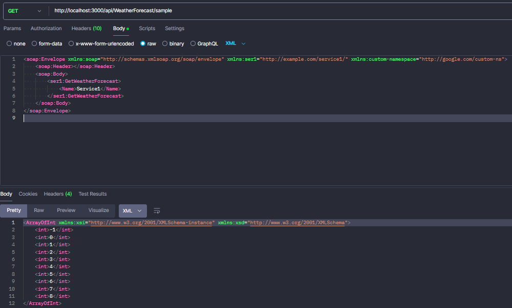
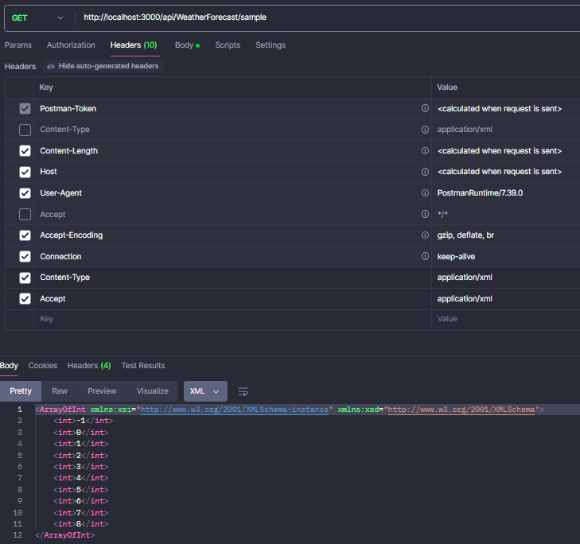

## Introduction

This demonstration represents the basic SOAP application. This demo aims to give you the visualization of SOAP, its structure in .NET code, its request/response format in XML, etc.

## How to use

- This application uses .NET Core 8.0 to run so if you don't have version 8.0 on machine, please kindly change version of .NET Core version in the SoapDemo.csproj as following:

```c#
<Project Sdk="Microsoft.NET.Sdk.Web">

  <PropertyGroup>
    <TargetFramework>net8.0</TargetFramework> // --> Change to your .NET version
    <Nullable>enable</Nullable>
    <ImplicitUsings>enable</ImplicitUsings>
  </PropertyGroup>

  <ItemGroup>
    <PackageReference Include="Microsoft.AspNetCore.OpenApi" Version="8.0.4" />
    <PackageReference Include="NewId" Version="4.0.1" />
    <PackageReference Include="Serilog.AspNetCore" Version="8.0.1" />
    <PackageReference Include="Swashbuckle.AspNetCore" Version="6.4.0" />
  </ItemGroup>

</Project>
```

- Running command

```bash
dotnet watch run
```

- Endpoints

Please use Postman to call these below APIs:

- http://localhost:3000/api/WeatherForecast/sample
- http://localhost:3000/api/WeatherForecast/negative-list

- Pictures




